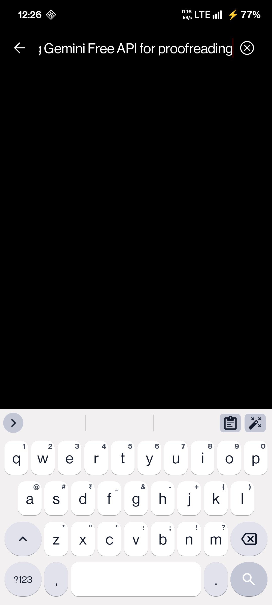
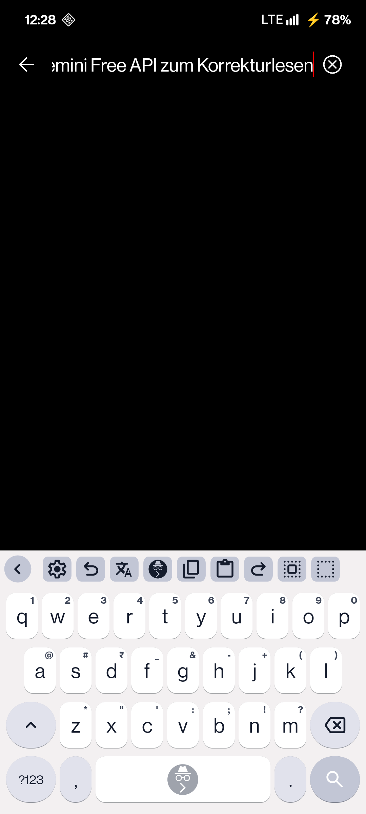
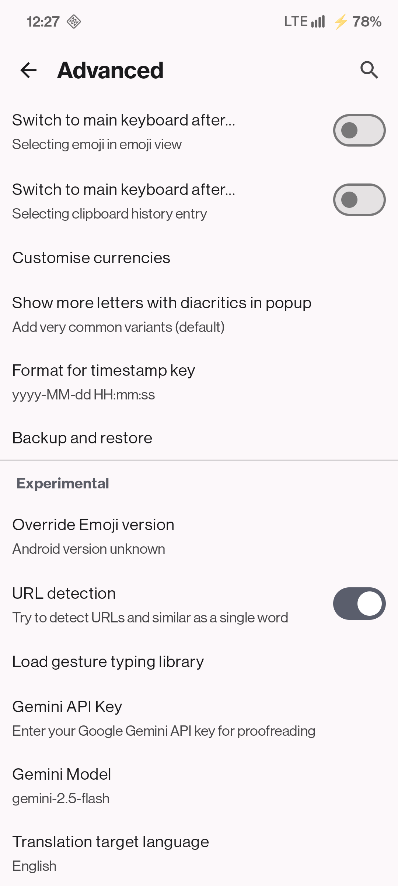
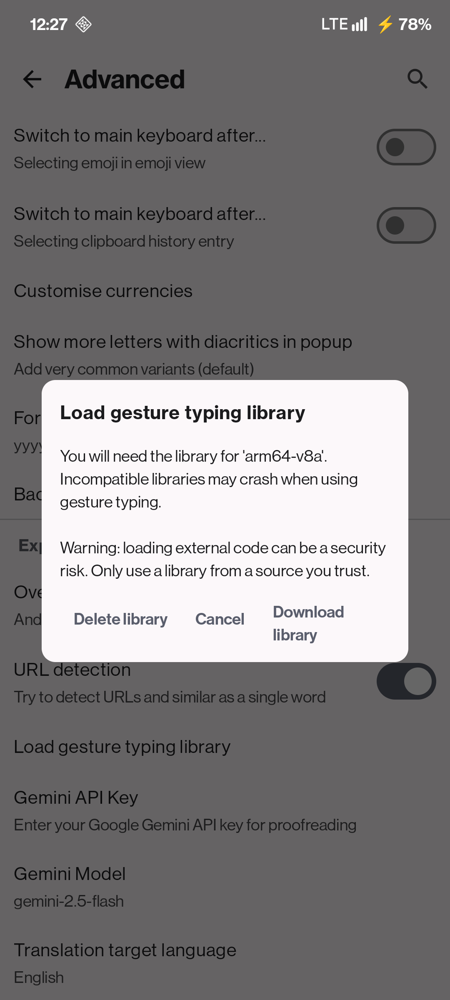
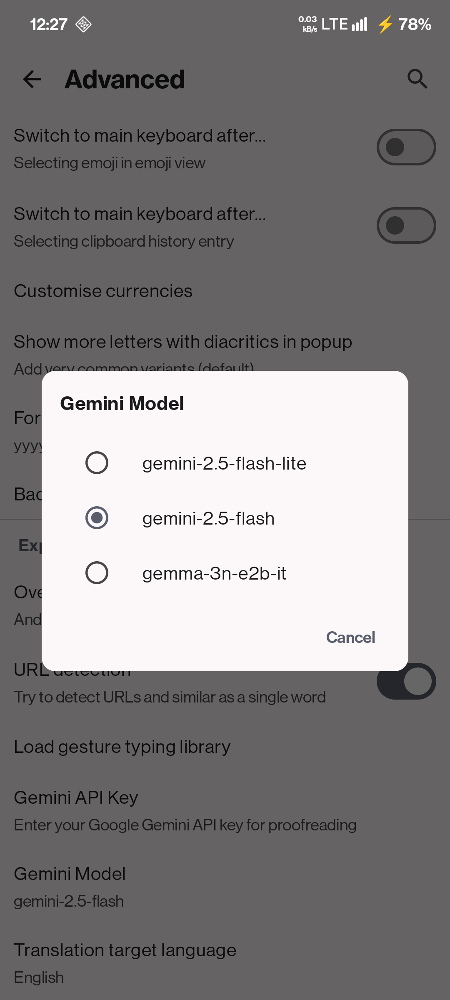
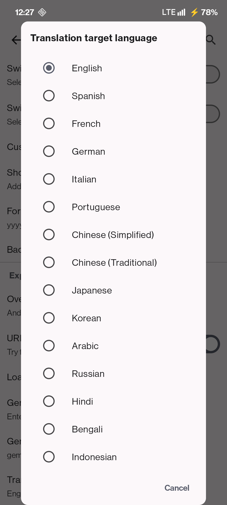

# HeliboardL

<picture>
  <source media="(prefers-color-scheme: dark)" srcset="docs/images/heliboardl_banner_dark.svg">
  <source media="(prefers-color-scheme: light)" srcset="docs/images/heliboardl_banner_light.svg">
  
</picture>

**HeliboardL** is a fork of [HeliBoard](https://github.com/Helium314/HeliBoard) - a privacy-conscious and customizable open-source keyboard based on AOSP/OpenBoard.

This fork adds **AI-powered features** using the Gemini API while maintaining the offline-first philosophy of the original.

## What's New in HeliboardL

- **🤖 Gemini AI Proofreading** - Fix grammar and spelling with one tap using toolbar key
- **🌐 AI Translation** - Translate selected text via toolbar
- **🎨 Enhanced Toolbar UI** - Squircle backgrounds for toolbar keys
- **🕵️ Incognito Mode Indicator** - Subtle watermark on spacebar when incognito is active
- **📥 Gesture Library Downloader** - Easier setup for glide typing

## Screenshots

<table>
  <tr>
    <td></td>
    <td></td>
    <td></td>
    <td></td>
    <td></td>
    <td></td>
  </tr>
</table>

## Download

You can download the latest release from the [GitHub Releases](https://github.com/LeanBitLab/HeliboardL/releases) page.

## Original HeliBoard Features

<ul>
  <li>Add dictionaries for suggestions and spell check</li>
  <li>Customize keyboard themes (style, colors and background image)</li>
  <li>Customize keyboard layouts</li>
  <li>Multilingual typing</li>
  <li>Glide typing (<i>requires closed source library</i>)</li>
  <li>Clipboard history</li>
  <li>One-handed mode</li>
  <li>Split keyboard</li>
  <li>Number pad</li>
  <li>Backup and restore settings</li>
</ul>

For original feature documentation, visit the [HeliBoard Wiki](https://github.com/Helium314/HeliBoard/wiki).

## Setup

### Gemini API Key (for AI features)
1. Get your free API key from [Google AI Studio](https://aistudio.google.com/apikey)
2. Go to HeliboardL Settings → Advanced → Gemini API Key
3. Enter your API key
4. Change gemini model to 2.5 flash or 3n
### Gesture/Glide Typing
Use the built-in gesture library downloader in Settings → Advanced → Load Gesture Typing Library.

## Contributing

For issues specific to HeliboardL features, please open an issue in this repository.

For issues with core HeliBoard functionality, please report to the [original HeliBoard repository](https://github.com/Helium314/HeliBoard/issues).

## License

HeliboardL (as a fork of HeliBoard/OpenBoard) is licensed under **GNU General Public License v3.0**.

See [LICENSE](/LICENSE) file.

## Credits

### Original Projects
- **[HeliBoard](https://github.com/Helium314/HeliBoard)** by Helium314 - The excellent keyboard this fork is based on
- [OpenBoard](https://github.com/openboard-team/openboard)
- [AOSP Keyboard](https://android.googlesource.com/platform/packages/inputmethods/LatinIME/)
- Original icon by [Fabian OvrWrt](https://github.com/FabianOvrWrt)

### HeliboardL
- Built with ❤️ by [LeanBitLab](https://github.com/LeanBitLab)

---

*HeliboardL • Privacy-focused keyboard with AI enhancements*
