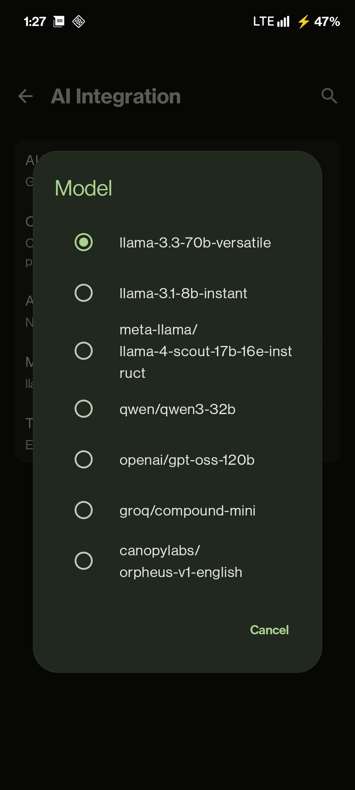
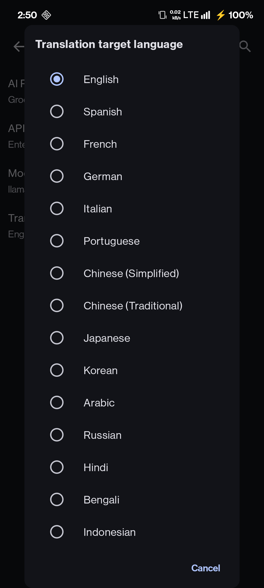
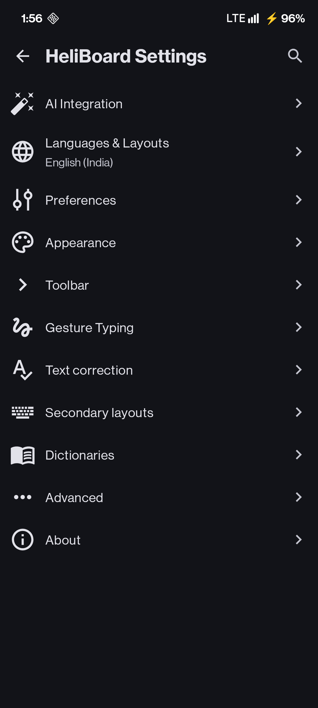

# HeliboardL

<picture>
  <source media="(prefers-color-scheme: dark)" srcset="docs/images/heliboardl_banner_dark.svg">
  <source media="(prefers-color-scheme: light)" srcset="docs/images/heliboardl_banner_light.svg">
  
</picture>

 

**HeliboardL** is a fork of [HeliBoard](https://github.com/Helium314/HeliBoard) - a privacy-conscious and customizable open-source keyboard based on AOSP/OpenBoard.

This fork adds **optional AI-powered features** using Gemini, Groq, and OpenAI-compatible APIs, offering a hybrid experience: a private, offline core with opt-in cloud intelligence.

## What's New in HeliboardL

- **🤖 Multi-Provider AI** - Proofread using **Gemini**, **Groq** (Llama 3, Mixtral), or **OpenAI-compatible** providers.
- **🛡️ Offline AI** - Private, on-device proofreading and translation using ONNX models (Offline build only).
- **🌐 AI Translation** - Translate selected text directly using your chosen AI provider.
- **⌨️ Dual Toolbar / Split Suggestions** - Option to split suggestions and toolbar for easier access.
- **🖱️ Touchpad Mode** - Swipe spacebar up to toggle touchpad; custom sensitivity controls.
- **🎨 Modern UI** - "Squircle" key backgrounds, refined icons, and polished aesthetics.
- **🔄 Google Dictionary Import** - Easily import your personal dictionary words.
- **⚙️ Enhanced Customization** - Force auto-capitalization toggle, reorganized settings, and more.
- **🕵️ Clear Incognito Mode** - Distinct "Hat & Glasses" icon for clear visibility.
- **🔒 Privacy Choices** - Choose **Standard** (Offline-first with opt-in AI) or **Offline** (Hard-disabled network) versions.

## Screenshots

<table>
  <tr>
    <td></td>
    <td></td>
    <td></td>
    <td></td>
    <td></td>
  </tr>
</table>

## Download

You can download the latest release from the [GitHub Releases](https://github.com/LeanBitLab/HeliboardL/releases) page.

### 📦 Choose Your Version

#### 1. Standard Version (`-standard-release.apk`)
*   **Features:** Full suite including **AI Proofreading**, **AI Translation**, and **Gesture Library Downloader**.
*   **Permissions:** Request `INTERNET` permission (used *only* when you explicitly use AI features).
*   **Setup:** Use the built-in downloader for Gesture Typing. Configure AI keys in Settings.

#### 2. Offline Version (`-offline-release.apk`)
*   **Features:** All UI/UX enhancements and **Offline Neural Proofreading** (ONNX).
*   **Permissions:** **NO INTERNET PERMISSION**. Guaranteed at OS level.
*   **Best For:** Privacy purists.
*   **Manual Setup Required:**
    *   **Gesture Typing:** [Download library manually](https://github.com/Helium314/HeliBoard/blob/master/app/src/main/jniLibs/arm64-v8a/libjni_latinimegoogle.so) and load via *Settings > Advanced*.
    *   **Offline AI:** Download ONNX models and load via *Settings > AI Integration*. 👉 **[See Offline Setup Instructions](docs/FEATURES.md#3-offline-proofreading-privacy-focused)**

## Original HeliBoard Features

<ul>
  <li>Add dictionaries for suggestions and spell check</li>
  <li>Customize keyboard themes (style, colors and background image)</li>
  <li>Customize keyboard layouts</li>
  <li>Multilingual typing</li>
  <li>Glide typing (<i>requires library</i>)</li>
  <li>Clipboard history</li>
  <li>One-handed mode</li>
  <li>Split keyboard</li>
  <li>Number pad</li>
  <li>Backup and restore settings</li>
</ul>

For original feature documentation, visit the [HeliBoard Wiki](https://github.com/Helium314/HeliBoard/wiki).

## Setup

### AI Features Setup

HeliboardL supports multiple AI providers: **Google Gemini**, **Groq**, and **OpenAI-compatible** (OpenRouter, HuggingFace, etc.).

👉 **[Read the Full AI Setup & Features Guide](docs/FEATURES.md)**

**Quick Start:**
1.  Get a free key from [Google AI Studio](https://aistudio.google.com/apikey) (Gemini) or [Groq Console](https://console.groq.com/keys) (Groq).
2.  Copy the API key.
3.  Go to **Settings → AI Integration → Set AI Provider**.
4.  Select your provider and paste the API Token.
5.  Select Model and target language

> [!IMPORTANT]
> **Privacy**: Your input data is sent to the configured provider.
> 👉 **[View Privacy Policies for Providers](docs/FEATURES.md#supported-ai-providers)**

## Contributing

For issues specific to HeliboardL features, please open an issue in this repository.

For issues with core HeliBoard functionality, please report to the [original HeliBoard repository](https://github.com/Helium314/HeliBoard/issues).

## License

HeliboardL (as a fork of HeliBoard/OpenBoard) is licensed under **GNU General Public License v3.0**.

See [LICENSE](/LICENSE) file.

## Credits

### Original Projects
- **[HeliBoard](https://github.com/Helium314/HeliBoard)** by Helium314 - The excellent keyboard this fork is based on
- [OpenBoard](https://github.com/openboard-team/openboard)
- [AOSP Keyboard](https://android.googlesource.com/platform/packages/inputmethods/LatinIME/)
- Original icon by [Fabian OvrWrt](https://github.com/FabianOvrWrt)

### HeliboardL
- Built with ❤️ by [LeanBitLab](https://github.com/LeanBitLab)

---

*HeliboardL • Privacy-focused keyboard with AI enhancements*
